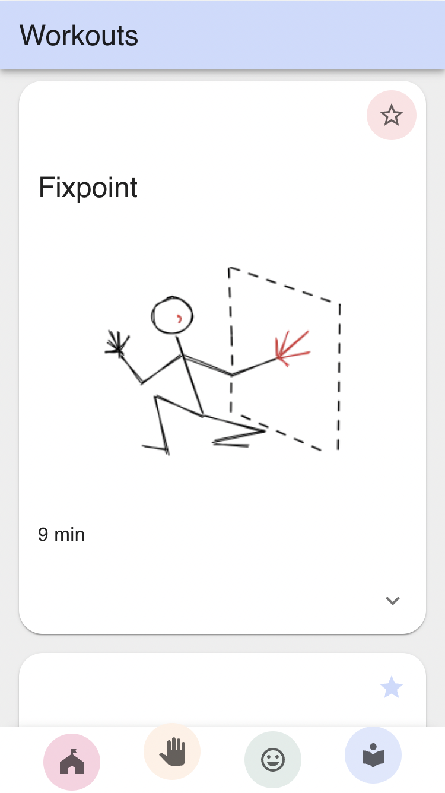
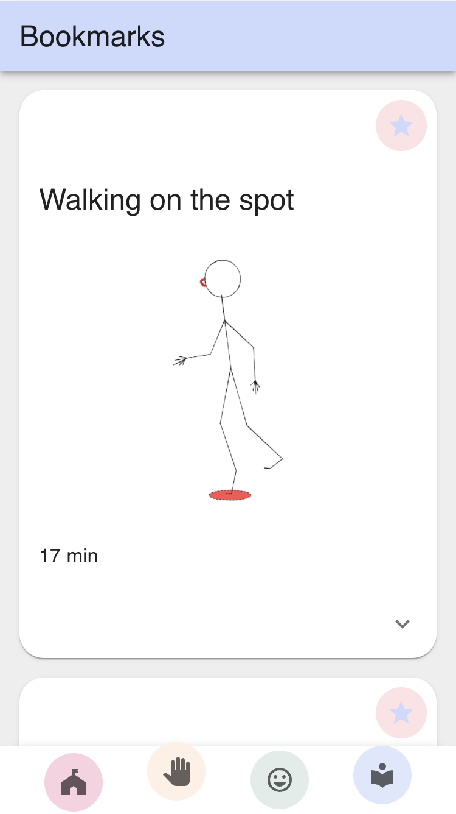

# MiME

**App for training and learning to mime**

<!--  -->

### **Learn to communicate non-verbally with MiME!**

> With exercises that come from a MongoDB database and can be bookmarked to your local storage!

 |

> Practice pantomime with simple exercises, memorize your favorites, and get excited about upcoming challenges added by an admin!

<!--  -->

### This is a capstone project for [neuefische](https://www.neuefische.de/) web development bootcamp.

To work with me feel free to contact me on [LinkedIn](https://www.linkedin.com/in/hannah-senft/) !

**_The app is currently optimized for mobile!_**

## `Tech Stack`

- React
- React Hooks
- Next.js
- Next-Auth.js
- MUI
- Emotion Styled-Components
- Node.js
- MongoDB
- Mongoose
- localStorage
